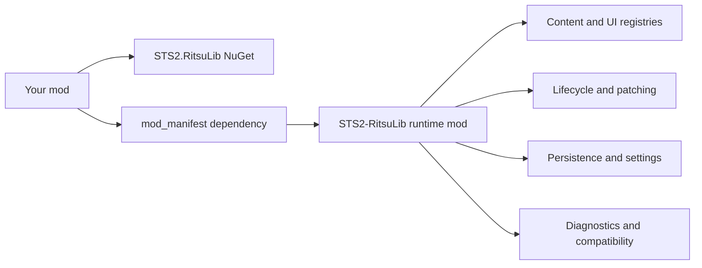

# STS2-RitsuLib

[](https://github.com/BAKAOLC/STS2-RitsuLib/actions/workflows/dev-build.yml)
[](https://github.com/BAKAOLC/STS2-RitsuLib/releases)
[](https://www.nuget.org/packages/STS2.RitsuLib)
[](LICENSE)

Shared framework library for Slay the Spire 2 mods.

[Documentation](https://sts2-ritsulib.ritsukage.com/) |
[Releases](https://github.com/BAKAOLC/STS2-RitsuLib/releases) |
[Chinese README](README.zh.md)

RitsuLib gives mod authors a stable layer for content registration, lifecycle hooks, Harmony patching, persistence,
settings UI, localization, audio, runtime UI, diagnostics, and compatibility helpers. It sits beside the base game API
and other libraries such as [BaseLib](https://github.com/Alchyr/BaseLib-StS2) instead of replacing them.

## What It Covers

| Area                | Examples                                                                                         |
|---------------------|--------------------------------------------------------------------------------------------------|
| Content authoring   | Cards, relics, potions, characters, events, encounters, timelines, unlocks, keywords, tags       |
| Runtime integration | Lifecycle events, patch helpers, Godot script registration, custom target types, runtime hotkeys |
| Data and settings   | JSON-backed stores, run-saved data, migrations, player-facing settings pages                     |
| Presentation        | FMOD helpers, top-bar buttons, card piles, toast messages, shell themes, export helpers          |
| Compatibility       | API capability gates, diagnostics, startup audits, analyzer-friendly conventions                 |



## Install

Add the NuGet package to your mod project:

```xml
<PackageReference Include="STS2.RitsuLib" />
```

Then declare the runtime dependency in `mod_manifest.json`.

For game API 0.105.x and newer, use the object form:

```json
{
  "dependencies": [
    { "id": "STS2-RitsuLib" }
  ]
}
```

For older game API branches, use the legacy string form because older manifest parsers may fail on dependency objects:

```json
{
  "dependencies": [
    "STS2-RitsuLib"
  ]
}
```

If your project does not use Central Package Management, let your package manager or IDE choose the current compatible
package version instead of copying a pinned version from this README.

## Package Choices

| Scenario                                                   | Compile-time package                  | Runtime install                            |
|------------------------------------------------------------|---------------------------------------|--------------------------------------------|
| Highest supported game API, usually the game's beta branch | `STS2.RitsuLib`                       | `STS2-RitsuLib` from GitHub releases       |
| Stable or older game API branch                            | `STS2.RitsuLib.Compat.<api-version>`  | Matching release asset or variant pack     |
| Player needs one folder for several API branches           | Your mod still references one package | `STS2-RitsuLib.<version>.variant-pack.zip` |

The variant pack installs one `mods/STS2-RitsuLib/` folder. Its root `STS2-RitsuLib.dll` is a loader, while the
API-specific builds live under `lib/<api-version>/`. This only changes how players install the runtime mod; it does not
change your compile-time NuGet reference.

The main `STS2.RitsuLib` package follows the highest Slay the Spire 2 API supported by this repository. Because the
game's highest API is often on a beta branch, use a compat package when your mod is meant for another public game
branch.

## Main Entry Points

Most mods start from these APIs:

| Need                                                               | Use                                                                           |
|--------------------------------------------------------------------|-------------------------------------------------------------------------------|
| Register models, keywords, epochs, card piles, and top-bar buttons | `RitsuLibFramework.CreateContentPack(modId)`                                  |
| Patch game methods with diagnostics                                | `RitsuLibFramework.CreatePatcher(modId, patcherName)`                         |
| React to framework or game timing                                  | `RitsuLibFramework.SubscribeLifecycle<TEvent>(...)`                           |
| Store profile or account data                                      | `RitsuLibFramework.BeginModDataRegistration(modId)` and `GetDataStore(modId)` |
| Store run-scoped data                                              | `RitsuLibFramework.GetRunSavedDataStore(modId)`                               |
| Add player-editable settings pages                                 | `RitsuLibFramework.RegisterModSettings(modId, configure)`                     |

Minimal content-pack registration:

```csharp
RitsuLibFramework.CreateContentPack("MyMod")
    .Card<MyCardPool, MyStrike>()
    .Relic<MyRelicPool, MyStarterRelic>()
    .Apply();
```

Start with the [getting-started guide](https://sts2-ritsulib.ritsukage.com/guide/getting-started), then use the topic
pages for the feature you are adding.

## Documentation

| Topic                         | Link                                                                    |
|-------------------------------|-------------------------------------------------------------------------|
| Getting started               | https://sts2-ritsulib.ritsukage.com/guide/getting-started               |
| Content authoring             | https://sts2-ritsulib.ritsukage.com/guide/content-authoring-toolkit     |
| Lifecycle events              | https://sts2-ritsulib.ritsukage.com/guide/lifecycle-events              |
| Patching                      | https://sts2-ritsulib.ritsukage.com/guide/patching-guide                |
| Persistence                   | https://sts2-ritsulib.ritsukage.com/guide/persistence-guide             |
| Mod settings                  | https://sts2-ritsulib.ritsukage.com/guide/mod-settings                  |
| Diagnostics and compatibility | https://sts2-ritsulib.ritsukage.com/guide/diagnostics-and-compatibility |

RitsuLib's own docs are concise feature references. For a broader Chinese walkthrough of Slay the Spire 2 modding, use:

[SlayTheSpire2 Modding Tutorials](https://glitchedreme.github.io/SlayTheSpire2ModdingTutorials/index.html)

Original repository for this tutorial: [GlitchedReme/SlayTheSpire2ModdingTutorials](https://github.com/GlitchedReme/SlayTheSpire2ModdingTutorials)

## Related Libraries

For minion, summon, companion-card, or guardian-style mechanics, prefer
[MinionLib](https://github.com/FuYnAloft/MinionLib). It focuses on creating and summoning minions, minion actions,
minion-card interactions, guardian behavior, custom targeting, and minion positioning. RitsuLib remains the general
framework layer and does not try to replace that specialized library.

## Optional Analyzer

The old companion analyzer
[STS2-ModAnalyzers-RitsuLib](https://github.com/BAKAOLC/STS2-ModAnalyzers-RitsuLib)
(`STS2.ModAnalyzers.RitsuLib`) is archived and no longer maintained.

For RitsuLib-style mods, the recommended optional analyzer is
[STS2RitsuLibModAnalyzers](https://github.com/alkaid616/STS2RitsuLibModAnalyzers)
(`Nothing.STS2RitsuLib.ModAnalyzers`). It provides Roslyn diagnostics for RitsuLib localization and resource paths, and
its package can automatically pass common project files to the analyzer through `buildTransitive`.

This analyzer is provided, maintained, and supported by a third party. RitsuLib does not guarantee that it fully matches
current RitsuLib capabilities or that all analyzer behavior is correct.

## Contributing

Use [local.props.template](local.props.template) to point the project at a Slay the Spire 2 install or API signature
folder. RitsuLib is a DLL-only mod (`has_pck: false`), so normal validation is a DLL build for each declared
compatibility target.

## Acknowledgements

See [ACKNOWLEDGEMENTS.md](ACKNOWLEDGEMENTS.md) for the people and users who helped shape RitsuLib.

## License

MIT
