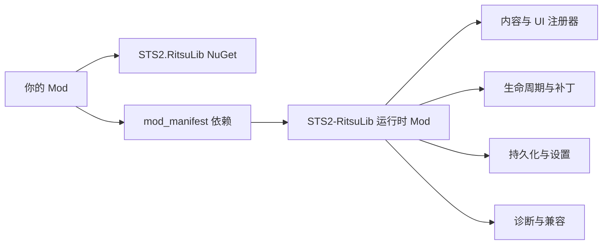

# STS2-RitsuLib

[](https://github.com/BAKAOLC/STS2-RitsuLib/actions/workflows/dev-build.yml)
[](https://github.com/BAKAOLC/STS2-RitsuLib/releases)
[](https://www.nuget.org/packages/STS2.RitsuLib)
[](LICENSE)

面向《杀戮尖塔 2》Mod 作者的共享框架库。

[文档站](https://sts2-ritsulib.ritsukage.com/) |
[Release](https://github.com/BAKAOLC/STS2-RitsuLib/releases) |
[English README](README.md)

RitsuLib 为 Mod 作者提供一层稳定 API，用来处理内容注册、生命周期、Harmony 补丁、持久化、设置界面、本地化、音频、运行时 UI、诊断和兼容辅助。它不替代游戏原生 API，也不要求放弃
[BaseLib](https://github.com/Alchyr/BaseLib-StS2)；它更像一套把常见 Mod 编写流程整理好的工程工具层。

## 覆盖范围

| 领域 | 示例 |
| --- | --- |
| 内容编写 | 卡牌、遗物、药水、角色、事件、遭遇、时间线、解锁、关键词、标签 |
| 运行时接入 | 生命周期事件、补丁辅助、Godot 脚本注册、自定义目标、运行时快捷键 |
| 数据与设置 | JSON 持久化、跑局存档数据、数据迁移、玩家可编辑设置页 |
| 表现层 | FMOD 辅助、顶栏按钮、卡堆、Toast、Shell 主题、导出辅助 |
| 兼容与诊断 | API 能力门控、诊断日志、启动审计、适合 analyzer 的工程约定 |



## 安装

在 Mod 项目中引用 NuGet 包：

```xml
<PackageReference Include="STS2.RitsuLib" />
```

然后在 `mod_manifest.json` 声明运行时依赖。

游戏 API 0.105.x 及之后使用对象写法：

```json
{
  "dependencies": [
    { "id": "STS2-RitsuLib" }
  ]
}
```

旧游戏 API 分支使用字符串写法；旧版 manifest 解析器可能无法解析 dependency 对象，甚至直接报错：

```json
{
  "dependencies": [
    "STS2-RitsuLib"
  ]
}
```

如果项目没有使用 Central Package Management，请让包管理器或 IDE 选择当前兼容的包版本，不要从 README 复制固定版本号。

## 包选择

| 场景 | 编译期包 | 运行时安装 |
| --- | --- | --- |
| 当前最高支持的游戏 API，通常是游戏 beta 分支 | `STS2.RitsuLib` | GitHub Release 中的 `STS2-RitsuLib` |
| 稳定分支或旧游戏 API 分支 | `STS2.RitsuLib.Compat.<api-version>` | 匹配的 release 资产或变体包 |
| 玩家需要一个文件夹支持多个 API 分支 | 你的 Mod 仍只引用一个包 | `STS2-RitsuLib.<version>.variant-pack.zip` |

变体包会安装一个 `mods/STS2-RitsuLib/` 文件夹。根目录的 `STS2-RitsuLib.dll` 是加载器，真正按 API 区分的构建位于
`lib/<api-version>/`。这只影响玩家安装运行时 Mod 的方式，不改变你的编译期 NuGet 引用。

主包 `STS2.RitsuLib` 会跟随本仓库支持的《杀戮尖塔 2》最高 API。由于游戏最高 API 通常在 beta 分支，如果你的 Mod 面向其他公开游戏分支，请使用对应的 compat 包。

## 常用入口

大多数 Mod 从这些 API 开始：

| 需求 | 使用 |
| --- | --- |
| 注册模型、关键词、Epoch、卡堆和顶栏按钮 | `RitsuLibFramework.CreateContentPack(modId)` |
| Patch 游戏方法并保留诊断信息 | `RitsuLibFramework.CreatePatcher(modId, patcherName)` |
| 响应框架或游戏时机 | `RitsuLibFramework.SubscribeLifecycle<TEvent>(...)` |
| 存储档案或账号数据 | `RitsuLibFramework.BeginModDataRegistration(modId)` 与 `GetDataStore(modId)` |
| 存储跑局内数据 | `RitsuLibFramework.GetRunSavedDataStore(modId)` |
| 添加玩家可编辑设置页 | `RitsuLibFramework.RegisterModSettings(modId, configure)` |

最小 content pack 注册示例：

```csharp
RitsuLibFramework.CreateContentPack("MyMod")
    .Card<MyCardPool, MyStrike>()
    .Relic<MyRelicPool, MyStarterRelic>()
    .Apply();
```

建议从[快速入门](https://sts2-ritsulib.ritsukage.com/guide/getting-started)开始，再按正在编写的功能阅读对应专题。

## 文档

| 主题 | 链接 |
| --- | --- |
| 快速入门 | https://sts2-ritsulib.ritsukage.com/guide/getting-started |
| 内容编写 | https://sts2-ritsulib.ritsukage.com/guide/content-authoring-toolkit |
| 生命周期事件 | https://sts2-ritsulib.ritsukage.com/guide/lifecycle-events |
| 补丁 | https://sts2-ritsulib.ritsukage.com/guide/patching-guide |
| 持久化 | https://sts2-ritsulib.ritsukage.com/guide/persistence-guide |
| Mod 设置 | https://sts2-ritsulib.ritsukage.com/guide/mod-settings |
| 诊断与兼容 | https://sts2-ritsulib.ritsukage.com/guide/diagnostics-and-compatibility |

RitsuLib 自带文档偏向简明功能参考。更完整的中文《杀戮尖塔 2》模组制作流程请看：

[SlayTheSpire2 Modding Tutorials](https://glitchedreme.github.io/SlayTheSpire2ModdingTutorials/index.html)

这个教程的原始仓库：[GlitchedReme/SlayTheSpire2ModdingTutorials](https://github.com/GlitchedReme/SlayTheSpire2ModdingTutorials)

## 相关库

如果 Mod 需要随从、召唤物、组件卡牌、守护等机制，推荐优先使用
[MinionLib](https://github.com/FuYnAloft/MinionLib)。它专门处理随从创建与召唤、随从主动行动、随从相关卡牌交互、守护机制、自定义目标和随从位置系统。RitsuLib 保持为通用框架层，不试图替代这类专用库。

## 可选分析器

旧的配套分析器
[STS2-ModAnalyzers-RitsuLib](https://github.com/BAKAOLC/STS2-ModAnalyzers-RitsuLib)
（包名：`STS2.ModAnalyzers.RitsuLib`）已经归档，不再维护。

RitsuLib 风格项目的推荐可选分析器是
[STS2RitsuLibModAnalyzers](https://github.com/alkaid616/STS2RitsuLibModAnalyzers)
（包名：`Nothing.STS2RitsuLib.ModAnalyzers`）。它提供 RitsuLib 本地化与资源路径相关的 Roslyn 诊断，并且包内
`buildTransitive` 会自动把常见项目文件传给 analyzer。

该分析器由第三方提供、维护和支持；RitsuLib 不保证它与当前 RitsuLib 能力完全对齐，也不保证所有分析器行为都正确。

## 参与开发

使用 [local.props.template](local.props.template) 指向《杀戮尖塔 2》安装目录或 API signature 目录。RitsuLib 是 DLL-only Mod（`has_pck: false`），正常验证路径是为声明的兼容目标分别执行 DLL 构建。

## 致谢

感谢在开发过程中帮助 RitsuLib 的人们，以及所有使用者。完整名单见 [ACKNOWLEDGEMENTS.md](ACKNOWLEDGEMENTS.md)。

## 许可证

MIT
